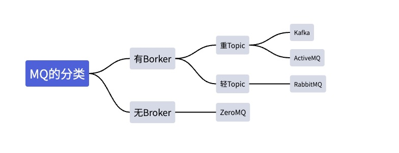

# Kafka概述

今天我们开始学习Kafka了，在学习Kafka之前，我们必须先了解消息队列！

## 消息队列
消息队列(Message Queue)简单可以理解为：将需要传输的消息放在队列里面形成的消息中间件即为消息队列。是分布式系统中重要的组件，其通用的使用场景可以简单地描述为：

> 当不需要立即获得结果，但是并发量又需要进行控制的时候，差不多就是需要使用消息队列的时候。

从上面的描述，我们可以直观了解到消息队列主要解决了应用耦合、异步处理、流量削锋等问题。

很多人都说，MQ通过将消息的发送和接受分离来实现应用程序的异步和解构，这给人的直觉是MQ是异步的，用来解耦的，但是这只是消息对应的效果而不是目的！

***消息队列真正的目的是为了通讯，它屏蔽了底层复杂的通信协议，定义了一套基于应用层的，更加简单的通信协议！***

想想看，一个分布式系统中通信的协议，要么是HTTP，要么是TCP，这两者都属于比较原始的通信协议，均有各自的优缺点。比如HTTP不支持两端通信，TCP更加原始，需要自定义粘包，心跳等，非常复杂。而MQ则利用了非常简单的生产者和消费者模型，构建出了一套简单的通信协议。MQ带给我们的不是具体的通信协议，而是更高层次的抽象的业务数据交换模型。提供给我们一个SDK，让我们可以更加实际的业务逻辑定义生产者和消费者来实现消息通信而无视底层通信协议！

* 生产者：产生并发送数据的角色。
* 消费者：接受并处理数据的角色。

### MQ的分类

我们通常可以通过是否有Broker来进行区分，所谓Broker，你可以理解为一个独立的消息中转站，生产者把消息发送给它就结束了自己的任务了，Broker则把消息主动推送给消费者。

对于有Broker的情况，可以分为以下两种：

* **重Topic**

生产者发送Key和数据到Broker，由Broker比较Key之后决定给那个消费者，着这种模式下，Topic往往是一个比较大的概念，甚至一个系统就只有一个Topic，Topic某种意义上面就是Queue。Kafka和ActiveMQ就属于这个流派，虽然，他们两个架构一样，但是Kafka的性能要比ActiveMQ高出数倍，所以，这种类型的MQ只有Kafka一种备选方案。

* **轻Topic**

这种模式下，Topic是一个轻量的概念，生产者发送Key和数据，消费者定义订阅的队列，Broker收到数据之后会通过一定的逻辑计算出Key对应的队列，然后把数据交给对应的队列处理。比较典型的是RabbitMQ。

对于没有Broker的MQ：

对于没有Broker的MQ，代表是ZeroMQ，该作者非常睿智的察觉到，MQ是更加高级的Socket，它解决的是通信问题，所以ZeroMQ被设计成一个“库”而不是一个中间件，这种实现的节点之间通信的消息都是发送到彼此的队列中，每个节点既是生产者也是消费者。ZeroMQ做的事情就是封装出一套类似于Socket的API可以完成数据发送，读取数据。

## Kafka介绍

Kafka是最初由Linkedin公司开发，是一个分布式、支持分区的、多副本的、基于zookeep协调的分布式消息系统。它的最大特征就是可以实时的处理大量数据，以满足各种需求场景，比如，基于Hadoop的批处理系统，低延迟的实时系统，storm/spark流式处理引擎,Web/Nginx日志, 访问日志消息服务等等。 用scarlet演编写，Linkedin应于2010年贡献给了Apache基金会并成为顶级开源项目。

### Kafka的使用场景
* 日志收集：一个公司可以用Kafka收集各种服务的log，通过Kafka以统一接口服务的方式可以开放给各种consumer，例如，Hadoop，Hbase，Solr等
* 消息系统：解耦生产者和消费者，缓存消息等。
* 用户活动跟踪：Kafka经常被用来记录Web用户或者APP用户的各种活动，如浏览网页，搜索，点击等活动，这些活动信息被各个服务器发布到Kafka的Topic中，然后订阅者可以订阅这些Topic来实现实时的监控分析，或者装在到Hadoop，数仓中做离线分析和数据挖掘。
* 运营指标：Kafka经常被用来记录监控运营监控数据，包括各种分布式应用的数据，生产各种操作的集中反馈，比如报警和报告。

## Kafka安装