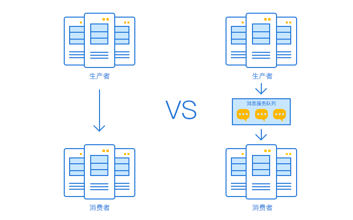
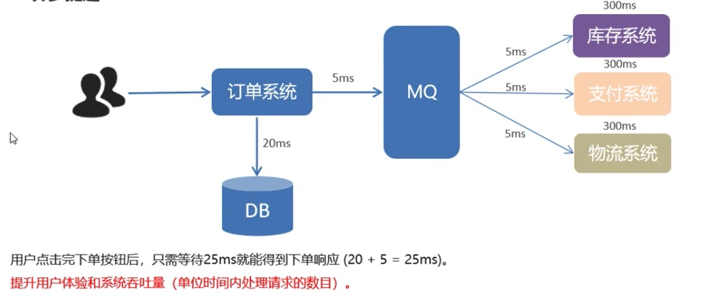
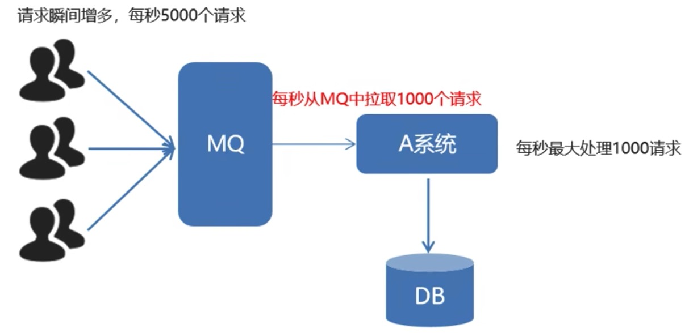
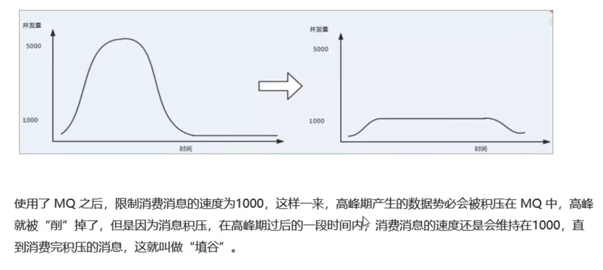
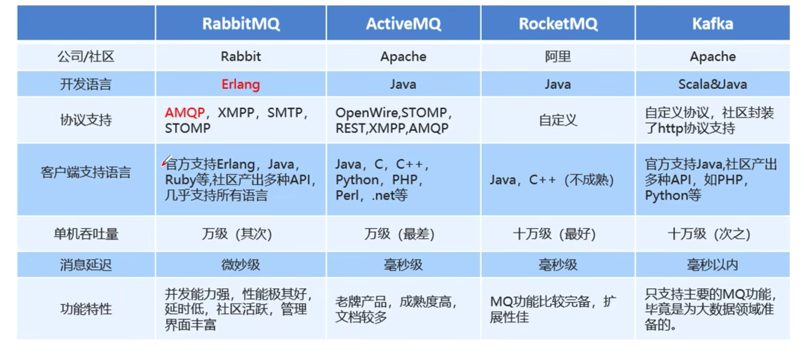

# 消息队列概述

消息队列(Message Queue)简单可以理解为：将需要传输的消息放在队列里面形成的消息中间件即为消息队列。是分布式系统中重要的组件，其通用的使用场景可以简单地描述为：

> 当不需要立即获得结果，但是并发量又需要进行控制的时候，差不多就是需要使用消息队列的时候。

## 消息队列的优势：

从上面的描述，我们可以直观了解到消息队列主要解决了应用耦合、异步提速、流量削锋填谷等问题。

### 解耦

在微服务领域，当一个服务调用另一个服务的时候，通常会使用HTTP/TCP请求来直接调用，如果被调用的服务出现宕机，那么整个请求链路将会报错，而此时，如果使用消息队列来讲两个服务之间的调用关系解耦，那么，消费者服务的异常将会通过消息队列进行缓冲，极大地提高了服务的容错能力。

### 异步提速

想象一个订单处理系统，当用户预定一件商品时，需要调用库存系统，支付系统以及物流系统的接口来完成请求，如果每个接口都耗费5ms，那么整个链路将是所有服务耗时的总和。此时如果使用了MQ，当用户点击完下单按钮后，只需要等待订单系统将消息发送到MQ即可，极大的提升了系统响应的速度。

### 削锋填谷

一般而言，系统的处理请求的并发量是有上线的，如果某个时间，遇到了像电商秒杀等场景，就会有超过并发上线多倍的请求传递过来，此时如果直接调用该服务，基本上就凉凉了。此时如果使用了MQ，就能起到流量削锋填谷的作用。

## 消息队列真正的价值

很多人都说，MQ通过将消息的发送和接受分离来实现应用程序的异步和解构，这给人的直觉是MQ是异步的，用来解耦的，但是这只是消息对应的效果而不是目的！

***消息队列真正的目的是为了通讯，它屏蔽了底层复杂的通信协议，定义了一套基于应用层的，更加简单的通信协议！***

想想看，一个分布式系统中通信的协议，要么是HTTP，要么是TCP，这两者都属于比较原始的通信协议，均有各自的优缺点。比如HTTP不支持两端通信，TCP更加原始，需要自定义粘包，心跳等，非常复杂。而MQ则利用了非常简单的生产者和消费者模型，构建出了一套简单的通信协议。MQ带给我们的不是具体的通信协议，而是更高层次的抽象的业务数据交换模型。提供给我们一个SDK，让我们可以更加实际的业务逻辑定义生产者和消费者来实现消息通信而无视底层通信协议！

* 生产者：产生并发送数据的角色。
* 消费者：接受并处理数据的角色。

## 消息队列的劣势

当然，任何东西都是一把双刃剑，有优势必有劣势，下面我们来看看它到底有啥劣势！

* **系统可用性降低**

对于一个系统而言，引入的外部依赖越多，系统的稳定性越差，一旦MQ宕机，就马上会对业务造成严重影响，所以，如何保证MQ的高可用是摆在开发人员面前的难题。

* **系统复杂度提高**

MQ的引入大大增加了系统的复杂度，以前系统间的调用是通过同步的方式直接调用，现在是通过MQ异步调用。所以，如何保证MQ的消息没有被重复消费？如何处理消息丢失？如何保证消息的顺序性？等都是需要思考的问题。

* **消息的一致性问题**

当一个消息涉及到多个系统或者服务时，如果其中的一个服务出现宕机或者处理异常，如何让其他服务队消息的处理进行回滚？如何保证消息数据处理的一致性？

## 消息队列的应用场景

既然MQ既有优势，又有劣势，那么该如何选择呢? 通常下面是一些需要再选择的时候考虑的点：

* 生产者不需要重消费者中获得反馈。引入消息队列之前的调用，其接口的返回值应该为空，这才能让异步成为可能。
* 系统能够在追求最终一致性的基础上，允许短暂的一致性。
* 当管理MQ的成本超过了MQ带来的优势时，是否还需要？

## MQ的分类

我们通常可以通过是否有Broker来进行区分，所谓Broker，你可以理解为一个独立的消息中转站，生产者把消息发送给它就结束了自己的任务了，Broker则把消息主动推送给消费者。

对于有Broker的情况，可以分为以下两种：

* **重Topic**

生产者发送Key和数据到Broker，由Broker比较Key之后决定给那个消费者，着这种模式下，Topic往往是一个比较大的概念，甚至一个系统就只有一个Topic，Topic某种意义上面就是Queue。Kafka和ActiveMQ就属于这个流派，虽然，他们两个架构一样，但是Kafka的性能要比ActiveMQ高出数倍，所以，这种类型的MQ只有Kafka一种备选方案。

* **轻Topic**

这种模式下，Topic是一个轻量的概念，生产者发送Key和数据，消费者定义订阅的队列，Broker收到数据之后会通过一定的逻辑计算出Key对应的队列，然后把数据交给对应的队列处理。比较典型的是RabbitMQ。

对于没有Broker的MQ：

对于没有Broker的MQ，代表是ZeroMQ，该作者非常睿智的察觉到，MQ是更加高级的Socket，它解决的是通信问题，所以ZeroMQ被设计成一个“库”而不是一个中间件，这种实现的节点之间通信的消息都是发送到彼此的队列中，每个节点既是生产者也是消费者。ZeroMQ做的事情就是封装出一套类似于Socket的API可以完成数据发送，读取数据。

## 常见MQ的对比

### Redis

在我们印象中，Redis 是一个 key-value 缓存中间件，而不是一个消息队列中间件。但 Redis 本身支持 MQ 功能，所以完全可以当做一个轻量级的队列服务来使用。

实验表明：入队时，当数据比较小时Redis的性能要高于RabbitMQ和Kafka，而如果数据大小超过了10K，Redis 则慢的无法忍受。出队时，无论数据大小，Redis都表现出非常好的性能，而RabbitMQ和Kafka的出队性能则远低于Redis。

基于上面这两点原因，Redis更适合用来做很小规模、业务简单的消息队列场景。 如果业务复杂、业务规模大，一般情况下Redis就会被排除。

### RabbitMQ

RabbitMQ 是使用 Erlang 编写的一个开源的消息队列，本身支持很多的协议：AMQP，XMPP, SMTP, STOMP，也正因如此，它非常重量级，更适合于企业级的开发。同时实现了 Broker 构架，这意味着消息在发送给客户端时先在中心队列排队。

其主要优势如下：
* 对路由，负载均衡或者数据持久化都有很好的支持。
* 凭借其灵活高效的配置，非常容易实现复杂的消息匹配，是很多中小型企业青睐的MQ。
* 对于延迟队列，能够基于扩展插件，非常容易的实现。
* 由于会在消息出问题或者消费错误的时候，可以重新入队或者移动消息到死信队列，继续消费后面的，会省心很多。

但是与Kafka相比，RabbitMQ通常有如下的缺陷：
1. 使用消息复制实现了发布订阅功能，会降低性能并耗费更多资源。
2. 多个消费者无法严格保证消息被消费的顺序。
3. 大量的订单集中在一个队列，吞吐量受到了限制。
4. 由于消息被消费之后就消失了，所以在事件溯源的情况下，不太适合。
5. Kafka 是每秒几十万条消息吞吐，而 RabbitMQ 的吞吐量是每秒几万条消息。 所以中小型企业比较推荐RabbitMQ。

