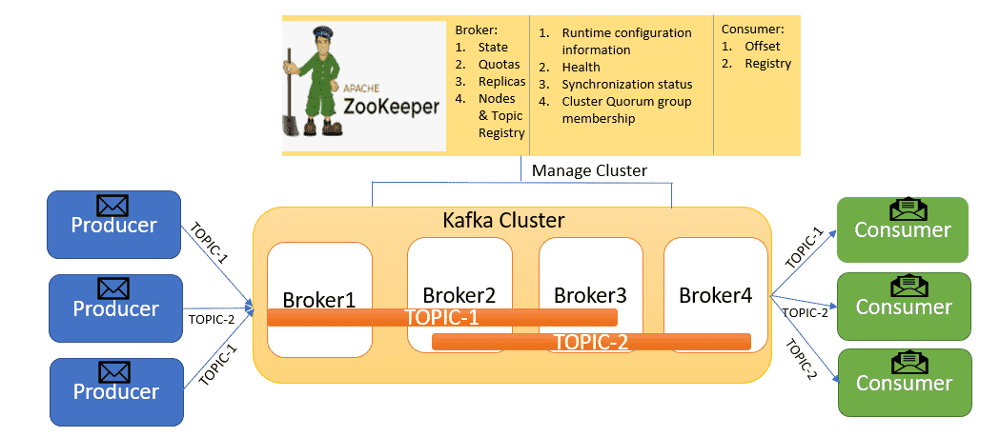

# 高可用的Kafka集群

今天我们就来学习高可用的Kafka集群，先来了解一些基本概念吧！

## Controller Broker

控制器组件（Controller），是 Apache Kafka 的核心组件。它的主要作用是在 Apache ZooKeeper 的帮助下管理和协调整个 Kafka 集群。集群中任意一台 Broker 都能充当控制器的角色，但是，在运行过程中，只能有一个 Broker 成为控制器，行使其管理和协调的职责。

那么，在众多的Broker种，Conterller Broker是如何被选举出来的呢？

实际上，Broker 在启动时，会尝试去 ZooKeeper 中创建controller节点。Kafka 当前选举控制器的规则是：第一个成功创建controller节点的 Broker 会被指定为控制器。

通常，Controller Broker有以下职责：

### 分区Leader的选举

当某个分区的Leader副本出现故障时，由控制器负责为该区选举新的Leader，选举的规则是从ISR(in-sync replica)集合的最左边获取。

### 新增或减少Broker时，通知其他Broker

当某个Broker节点由于故障离开Kafka群集时，则存在于该Broker的leader分区将不可用(由于客户端仅对leader分区进行读写操作)。为了最大程度地减少停机时间，需要快速找到替代的leader分区。

Controller将收到通知并对此采取行动，决定哪些Broker上的分区成为leader分区，然后，它会通知每个相关的Broker，要么将Broker上的主题分区变成leader，要么通过LeaderAndIsr请求从新的leader分区中复制数据。

当Controller注意到Broker已加入集群时，它将使用Broker ID来检查该Broker上是否存在分区，如果存在，则Controller通知新加入的Broker和现有的Broker，新的Broker上面的follower分区再次开始复制现有leader分区的消息。为了保证负载均衡，Controller会将新加入的Broker上的follower分区选举为leader分区。

### 管理分区

当使用`kafka-topics.sh`脚本为某个topic增加分区时，同样还是由Conterller负责让新分区被其他节点感知到。

## Rebalance机制(重平衡机制)

重平衡跟消费组紧密相关，它保证了消费组成员分配分区可以做到公平分配，也是消费组模型的实现，消费组模型如下：

要想实现以上消费组模型，那么就要实现当外部环境变化时，比如主题新增了分区，消费组有新成员加入等情况，实现动态调整以维持以上模型，那么这个工作就会交给 Kafka 重平衡机制去处理。

Kafka 重平衡是外部触发导致的，触发 Kafka 重平衡的有以下几种情况：
* 消费组成员发生变更，有新消费者加入或者离开，或者有消费者崩溃；
* 消费组订阅的主题数量发生变更；
* 消费组订阅的分区数发生变更。

### 重平衡流程

在新版本中，消费组的协调管理已经依赖于 Broker 端某个节点，该节点即是该消费组的 Coordinator， 并且每个消费组有且只有一个 Coordinator，它负责消费组内所有的事务协调，其中包括分区分配，重平衡触发，消费者离开与剔除等等，整个消费组都会被 Coordinator 管控着，在每个过程中，消费组都有一个状态，Kafka 为消费组定义了 5 个状态，如下：

* Empty：消费组没有一个活跃的消费者；
* PreparingRebalance：消费组准备进行重平衡，此时的消费组可能已经接受了部分消费者加入组请求；
* AwaitingSync：全部消费者都已经加入组并且正在进行重平衡，各个消费者等待 Broker 分配分区方案；
* Stable：分区方案已经全部发送给消费者，消费者已经在正常消费；
* Dead：该消费组被 Coordinator 彻底废弃。

可以看出，重平衡发生在 PreparingRebalance 和 AwaitingSync 状态机中，重平衡主要包括以下两个步骤：

* **加入组(JoinGroup)**：当消费者心跳包响应 REBALANCE_IN_PROGRESS 时，说明消费组正在重平衡，此时消费者会停止消费，并且发送请求加入消费组；
* **同步更新分配方案：** 当 Coordinator 收到所有组内成员的加入组请求后，会选出一个consumer Leader，然后让consumer Leader进行分配，分配完后会将分配方案放入SyncGroup请求中发送会Coordinator，Coordinator根据分配方案发送给每个消费者。

### 重平衡策略

通常，Rebalance会有如下三种分区策略：
* Range：通过公式计算某个消费者消费哪几个分区，计算公式为：消费者分区总数 / 消费者数量 + 1。
* 轮询：大家轮着来
* Sticky：粘合策略，如果需要Rebalance，会在之前已经分配的基础之上调整，不会改变之前的分配情况。

## HW(高水位)

HW俗称高水位，是HighWatermark的缩写，取一个分区中对应的ISR最小的LEO(log-end-offset)作为HW，Consumer最多只能消费到HW的位置。另外，每个Replica都有HW，Leader和follower都各自负责更新自己的HW状态。对于Leader新写入的消息，Consumer不能立即消费，Leader会等待该消息被IRS中的所有Replica同步后更新HW，此时消息才能被Consumer消费。这样就保证了如果leader所在的Broker失效，该消息任然可以从新选举的Leader种获取。