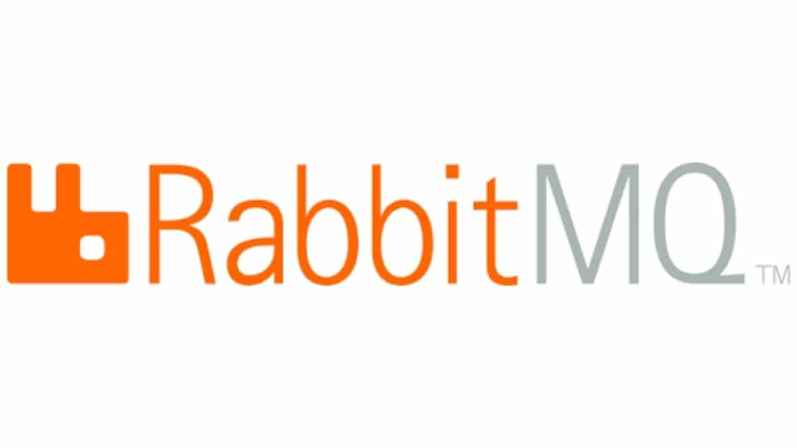

# RabbitMQ 介绍



RabbitMQ 是采用 Erlang 语言实现 AMQP（Advanced Message Queuing Protocol）高级消息队列协议 的消息中间件，最初起源于金融系统，用于在 分布式系统中存储转发消息。

Rabbit 英译为兔子，含义为：兔子行动非常迅速且繁殖起来非常疯狂。因此使用 RabbitMQ 来命名这个分布式软件。

在RabbitMQ诞生之前，为了解决商业软件之间应用互通的问题，Sun公司提供了一套标准：JMS(Java Message Service), JMS 试图通过提供 公共 Java API 的方式，隐藏单独 MQ 产品供应商提供的时实际接口，解决了互通问题。从技术上讲：只要针对 JMS API 编程，选择合适的 MQ 驱动，JMS 会打理好其他的部分。ActiveMQ 就是 JMS 的一种实现。由于 JMS 使用单独标准化接口来胶合众多不同的接口，最终会暴露出问题，使得程序变得脆弱。急需一种新的消息通信标准化方案。

然而，JMS仅仅针对于Java应用程序的标准，但是对于更高层面，并没有一种跨平台，跨语言的应用层协议标准。

2006 年 6 月，由 Cisco、Redhat、iMatix 等联合制定了 AMQP 的公开标准，它是 应用层协议的一个开放标准，以解决众多消息中间件的需求和拓扑结构问题。它为“面向消息的中间件”设计，基于此协议的客户端与消息中间件可传递消息，并不受产品、开放语言等条件的限制。

2007年，Rabbit技术公司于AMQP标准开发的RabbitMQ 1.0发布！最初版本实现了 AMQP 的一个关键特性：使用协议本身就可以对队列和交换器（Exchange）这样的资源进行配置。而商业 MQ 则需要特定的管理终端。RabbitMQ 的资源配置能力使其成为构建分布式应用的最完美的通信总线。

## RabbitMQ的优势

RabbitMQ 发展到今天，被越来越多人认可，这和它在易用性、扩展性、可靠性和高可用性等方面的卓越表现是分不开的。具体特点可以概括为以下几点：

* 可靠性：使用一些机制来保证可靠性，如：持久化、传输确认、发布确认等。
* 灵活的路由：在消息进入队列之前，通过 交换器 来 路由 消息，对于典型的路由功能，提供了内置的交换器来实现。针对复杂的路由功能，可以将多个交换器绑定在一起，也可以通过插件机制来实现自己的交换器。
* 扩展性：多个 RabbitMQ 节点可以组成一个集群，也可以动态扩展集群节点。
* 高可用性：队列可以在集群中的机器上设置镜像，使得在部分节点出现问题的情况下，队列仍然可用。
* 多种协议：原生支持 AMQP 协议，还支持 STOMP、MQTT 等多种消息中间件协议
* 多语言客户端：支持常用语言客户端，如：Java、Python、Ruby、PHP、C#、JavaScript
* 管理界面：提供了一个易用的用户界面，使得用户可以 监控和管理消息、集群中的节点 等
* 插件机制：提供了许多插件，以实现从多方面进行扩展，也可以自己编写插件。

## RabbitMQ基础架构图

下面是RabbitMQ的架构图：


这里面会涉及到如下的常见概念：
* **Broker**：接受和分发消息的应用，RabbitMQ Server就是Message Broker。
* **Virtual Host**: 处于多租户和安全因素的设计，把AMQP的基本组件划分到一个虚拟的分组中，类似于网络中的namespace概念。当多个不同的用户使用同一个RabbitMQ Server提供服务时，可以划分出多个vhost，每个用户在自己的vhost中创建Exchange和Queue等。
* **Connection**：publisher/consumer和Broker之间建立的TCP连接。
* **Channel**：如果每一次访问RabbitMQ都建立一个Connect，那么在消息数量巨大的时候建立TCP Connection的开销将是巨大的，效率也很低。Channel是在Connection内部建立的逻辑连接，如果应用程序支持多线程，通常每个线程建立单独的Channel进行通讯，AMQP method包含了Channel id帮助客户端和Message Broker识别Channel，所以Channel之间是完全隔离的。Channel作为轻量级的Connection极大的减少了操作系统建立TCP Connection的开销。
* **Exchange**：Message到达Broker的第一站，根据分发规则，匹配查询表中的routing key，分发消息到queue中去。常用的类型有：direct(point-to-point)，topic(publish-subscribe), fanout(multcast).
* **Queue**: 消息最终将会被送到这里，等待subscribe取走。
* **Binding**: Exchange与Queue之间建立的虚拟连接，binding中可以包含routing key。Binding信息被保存到Exchange中的查询表中，用于Message的分发依据。

## RabbitMQ搭建

自从有了Docker，搭建任务应用程序都变得Easy，RabbitMQ也不例外。

```shell
docker pull rabbitmq # 拉取镜像
docker run --hostname my-rabbit --name myRabbit -e RABBITMQ_DEFAULT_USER=user -e RABBITMQ_DEFAULT_PASS=password rabbitmq # 启动镜像
```

参数说明如下：
* -d: 后台运行容器；
* --name: 指定容器名；
* -p: 指定服务运行的端口（5672：应用访问端口；15672：控制台Web端口号）；
* -v: 映射目录或文件；
* --hostname:  主机名（RabbitMQ的一个重要注意事项是它根据所谓的 “节点名称” 存储数据，默认为主机名）；
* -e: 指定环境变量；（RABBITMQ_DEFAULT_VHOST：默认虚拟机名；RABBITMQ_DEFAULT_USER：默认的用户名；RABBITMQ_DEFAULT_PASS：默认用户名的密码）

我们需要进入docker容器，启用web管理访问控制台：
```
[root@hostM1 ~]# docker exec -it 6db4bbe93afe /bin/bash
root@6db4bbe93afe:/# 
root@6db4bbe93afe:/# rabbitmq-plugins enable rabbitmq_management
The following plugins have been enabled:
  amqp_client
  cowlib
  cowboy
  rabbitmq_web_dispatch
  rabbitmq_management_agent
  rabbitmq_management

Applying plugin configuration to rabbit@6db4bbe93afe... started 6 plugins.
```
使用浏览器，打开Web地址：http://localhost:15672, 使用admin/admin登录，既可以看到如下界面：

