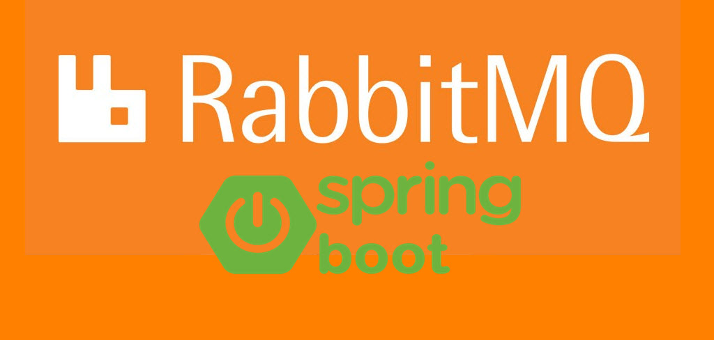
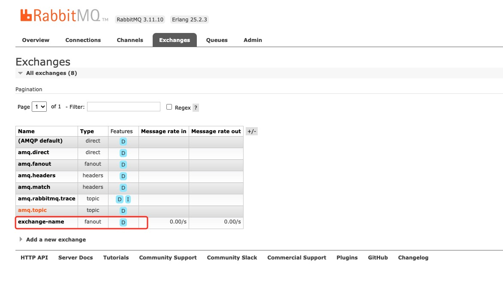
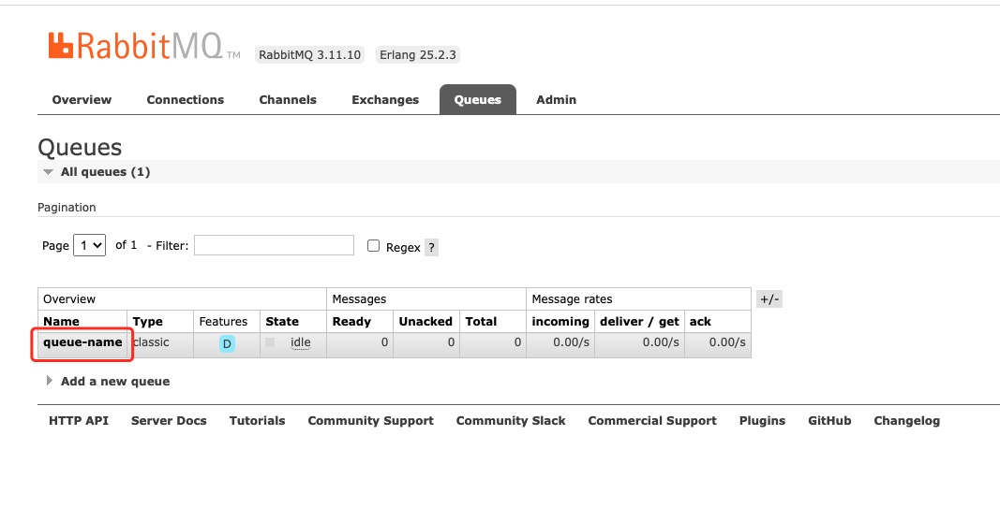

# Spring Boot 基于RabbitMQ



学习了RabbitMQ的基本工作模式之后，只有与Spring Boot结合起来，才能让RabbitMQ发挥最大的价值，下面我们就来教大家Spring Boot如何集成RabbitMQ！

## 引入依赖和配置

在初始化的Spring Boot应用程序中，引入下面的依赖：
```
dependencies {
	implementation 'org.springframework.boot:spring-boot-starter-web'
	implementation 'org.springframework.boot:spring-boot-starter-amqp'
	testImplementation 'org.springframework.boot:spring-boot-starter-test'
}
```

然后在`application.yml`配置文件中加入下面的配置：
```yml
spring:
  rabbitmq:
    host: localhost
    port: 5671
    username: guest
    password: guest
```

## 定义队列和交换机

在生产者这边，需要定义相关的交换机，队列和交换机与队列的关联关系：

```java
@Configuration
public class RabbitMQConfig {
    public static final String EXCHANGE_NAME = "exchange-name";
    public static final String QUEUE_NAME = "queue-name";

    @Bean("test-exchange")
    public Exchange exchange() {
        return ExchangeBuilder.fanoutExchange(EXCHANGE_NAME).durable(true).build();
    }

    @Bean("test-queue")
    public Queue queue() {
        return QueueBuilder.durable(QUEUE_NAME).build();
    }

    @Bean
    public Binding bindQueueExchange(@Qualifier("test-queue") Queue queue, @Qualifier("test-exchange") Exchange exchange) {
        return BindingBuilder.bind(queue).to(exchange).with("").noargs();
    }
}
```

## 定义生产者发送消息的接口

在RabbitMQ中，Spring提供了RabbitMessagingTemplate用于发送消息：

```java
@RestController
public class ProducerController {

    @Autowired
    private RabbitMessagingTemplate rabbitMessagingTemplate;

    @PostMapping("/send-message/{value}")
    public void sendMessage(@PathVariable String value) {
        rabbitMessagingTemplate.convertAndSend(RabbitMQConfig.EXCHANGE_NAME, "", value);
    }
}
```

## 定义消费者

消费者非常简单，使用注解`@RabbitListener`指定即可：
```java
@Component
public class MessageListener {
    @RabbitListener(queues = RabbitMQConfig.QUEUE_NAME)
    public void listenerQueue(String message){
        System.out.println("================================");
        System.out.println(message);
    }
}
```

## 启动程序，查看结果

启动应用程序，我们可以从后台看到我们定义的Exchange和Queue：





使用下面的命令发送消息：
```bash
curl --location --request POST 'http://localhost:8080/send-message/helloworld'
```

我们可以看到消费者成功消费了该消息：

```bash
================================
helloworld
```