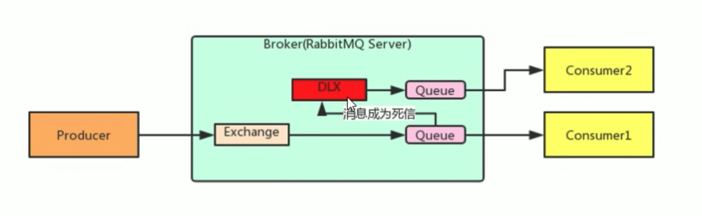

# RabbitMQ高级特性


通过前面的课程，我们已经学习了RabbitMQ的基本使用了，但是这还远远不够，特别是如果你想知道RabbitMQ与其他队列比如Kafka之间的主要区别时，才能知道RabbitMA真正的高级特性有多么的灵活和好用。今天我们就来学习一些RabbitMQ的高级用法！

## 消息可靠性

RabbitMQ与其他队列项目，其中消息的可靠性属于比较重要的优势，特别是在金融领域，尤其重要。那么如何做到消息的可靠性呢？首先我们来分析一下RabbitMQ的架构！


从上面的架构图中，我们可以看出，一条消息要让消费者接受，必须要经过 生产者-->Broker-->Exchange-->Queue--->消费者，此链路可以分为三个部分：
### 生产者 到 Exchange

当连接出现问题的时候，在客户端和服务端之间的消息可能正在投递中，还没有被Broker接收，它们可能正在被编码或者解码，或者一些其他的情况。在这种场景下，消息并没有被投递，那么它们是需要被重新投递以保障业务稳定性。

此时，通常的做法是使用Confirm模式来确认消息被正确接受：RabbitMQ的Exchange接收到消息之后，给消息生产者以确认(可以通过回调来实现)，告诉生产者自己已经成功收到了消息。

代码实现如下：
```java
@Autowired
    private RabbitTemplate rabbitTemplate;

@PostMapping("/send-message/{value}")
public void sendMessage(@PathVariable String value) {
    rabbitTemplate.setConfirmCallback(new RabbitTemplate.ConfirmCallback() {
        @Override
        public void confirm(CorrelationData correlationData, boolean b, String s) {
            // 这里是confirm callback执行的回调函数
            System.out.println("confirm 被执行了");
        }
    });

    rabbitTemplate.convertAndSend(RabbitMQConfig.EXCHANGE_NAME, "", value);
}
```

并且在application.yml里面开启Confirm回执确认：
```yml
spring:
  rabbitmq:
    // others configurations
    publiser-confirms: true
```
### Exchange 到 Queue

从Exchange到Queue的处理可以使用Return模式，将消息回退给Producer，与Confirm处理类似，也需要通过回调函数来执行：

```java
@Autowired
    private RabbitTemplate rabbitTemplate;

    @PostMapping("/send-message/{value}")
    public void sendMessage(@PathVariable String value) {
        rabbitTemplate.setReturnsCallback(new RabbitTemplate.ReturnsCallback() {
            @Override
            public void returnedMessage(ReturnedMessage returnedMessage) {
                System.out.println("消息被退了回来：" + returnedMessage.getMessage().toString());
            }
        });
        rabbitTemplate.convertAndSend(RabbitMQConfig.EXCHANGE_NAME, "", value);
    }
```

并且在application.yml里面开启Return回执确认：
```yml
spring:
  rabbitmq:
    // others configurations
    publiser-return: true
```

### Queue 到 消费者

要保证从Queue到消费者这段链路的可靠性，就需要用到ACK啦，即Acknowledge，表示消费端收到消息的确认方式。通常有以下三种设置：
* None：自动确认，当消息一旦被Consumer接收到，则自动确认收到，并将相应的Message从RabbitMQ的消息缓存中移除。这种方式在实际使用中，很可能在消息接收到之后，业务处理出现异常的情况下，丢失消息。
* Manual：手动确认，设置了这种方式，则需要在业务处理完成后，调用`channel.basicAck()`方法手动签收，如果出现了异常，则手动调用`channel.basicNack()`方法，让队列自动重新发送。
* Auto：根据异常情况来设置，比较麻烦，不常用。

实现代码如下：
```java
@Component
public class MessageListener2 implements ChannelAwareMessageListener {
    @Override
    @RabbitListener(queues = RabbitMQConfig.QUEUE_NAME)
    public void onMessage(Message message, Channel channel) throws Exception {
        long deliveryTag = message.getMessageProperties().getDeliveryTag();
        try {
            System.out.println(message.getBody().toString());
            channel.basicAck(deliveryTag, true);
        } catch (Exception e) {
            channel.basicNack(deliveryTag, true, true);
        }
    }
}
```

当然，除了上面的三种方式可以保证之外，RabbitMQ还提供了我们一种通过事物的方式来保证可靠性，这种方式最大的缺点是性能损耗较为严重，不常用。

## 消费者限流

前面我们学习MQ的价值的时候，提到了削峰填谷，而消费者限流就是可以满足这个场景。

消息队列限流是指在服务器面临巨额流量时，为了进行自保，进行的一种救急措施。因为巨大的流量代表着非常多的消息，这些消息如果多到服务器处理不过来就会造成服务器瘫痪，影响用户体验，造成不良影响。

RabbitMQ提供了一种QOS(服务质量保证)功能，即在非自动确认消息的前提下，如果一定数目的消息还未被消费确认，则不进行新消息的消费。

我们只需要配置一下rabbitmq.listener.simple下的prefetch属性即可，为了演示方便我这里配置为10条，语义即为：如果队列中有10条以上未签收的消息，则不进行新的消息消费。

在application.yml里面配置如下：
```java
spring:
  rabbitmq:
    listener:
      simple:
        acknowledge-mode: manual
        prefetch: 10
```

这种方式下消息一定要进行手动签收，上面我们讲过我们讲过，自动签收是消息一达到消费端就进行签收了，可能我们的业务逻辑还没运行就已经进行签收了，所以自动签收状态下开启限流几乎没有作用。

## TTL

TTL是Time To Live的缩写，也就是生存时间的意思，RabbitMQ支持消息的过期时间，在消息发送时可以进行指定，也支持队列的过期时间，从消息入队列开始计算，只要超过了队列的超时时间配置，那么消息会自动的清除。 如果既设置了队列的过期时间，又设置了消息的过期时间，则以时间短的为准。

需要注意的是：消息过期后，只有在消息队列顶端，才会判断是否过期！(是否会被移除掉)

* 设置队列的过期时间
```java
@Bean("test-queue")
public Queue queue() {
    return QueueBuilder.durable(QUEUE_NAME).ttl(10000).build();
}
```

* 设置消息的过期时间
```java
MessageProperties props = MessagePropertiesBuilder.newInstance()
                .setExpiration("10000").build();
Message message = new Message(value.getBytes(StandardCharsets.UTF_8), props);
rabbitTemplate.send(RabbitMQConfig.EXCHANGE_NAME, "", message);
```

## 死信队列

私信队列，英文缩写是DLX，Dead Letter Exchange(死信交换机)。虽然叫队列，但其实指的是Exchange，或者说指的Exchange和它所属的Queue，他俩一块构成了死信队列。

当消息被定义为Dead Message后，可以被重新发送到另一个交换机，这个交换机就是DLX。



所以，在什么情况下消息会被定义为死信呢？

通常有以下三种情况：
* 消费被拒绝（basic.reject/basic.nack）并且requeue=false
* TTL过期，消息过期之后没有被消费
* 要进入的队列达到最大长度

这三种情况，就可以判定一条消息死了，这种消息如果我们没有做处理，它就会被自动删除。

但其实我们可以在队列上加上一个参数，使当队列中发现了死亡的消息之后会将它自动转发到某个Exchange，由指定的Exchange来处理这些死亡的消息，这就用到了死信队列啦！

代码实现如下：
```java
@Bean("test-queue")
public Queue queue() {
    return QueueBuilder.durable(QUEUE_NAME).ttl(10000).deadLetterExchange("dlx-exchange").build();
}

@Bean("dlx-exchange")
public Exchange dlxExchange() {
    return ExchangeBuilder.fanoutExchange(EXCHANGE_NAME).durable(true).build();
}

@Bean("dlx-queue")
public Queue dlxQueue() {
    return QueueBuilder.durable(QUEUE_NAME).build();
}

@Bean
public Binding bindDLXQueueExchange(@Qualifier("dlx-queue") Queue queue, @Qualifier("dlx-exchange") Exchange exchange) {
    return BindingBuilder.bind(queue).to(exchange).with("").noargs();
}
```