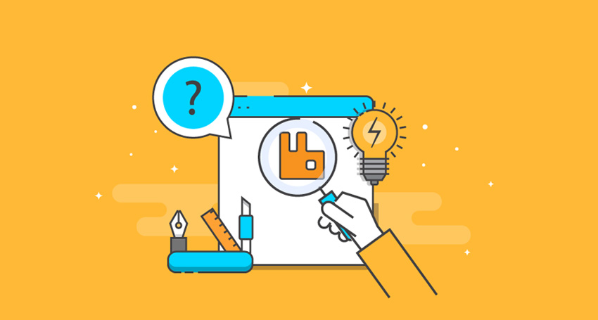
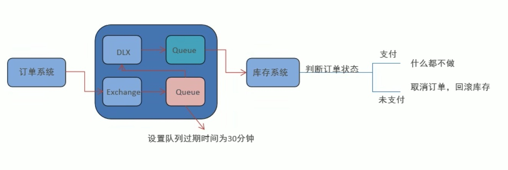
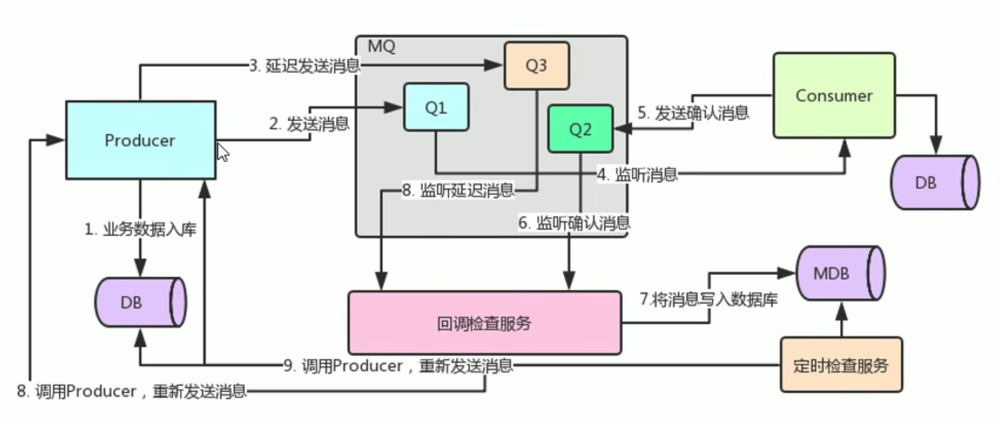
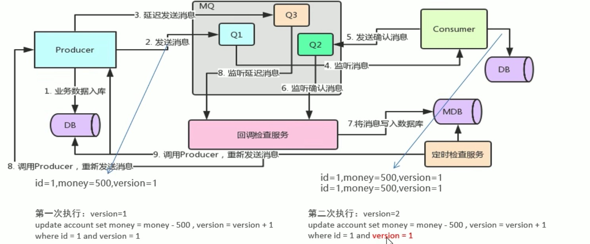

# RabbitMQ 常见应用问题

掌握了RabbitMQ的高级特性之后，今天，我们来研究一下RabbitMQ的常见问题及其解决方案！

## 延迟队列

延迟队列，即消息进入队列之后，不会被立即消费，只要到达指定时间之后，才能被消费。

延迟队列也是一个消息队列，只是它是一个带延迟功能的消息队列。简单说，在实际开发中，对于某些业务场景，我们需要让队列中的消息在指定时间时候才被消费者消费，例如：

* 场景一：订单下单之后一定时间未支付会自动取消订单
* 场景二：涉及到T+d（工作日延迟）或者D+d（自然日延迟）等延迟交付的场景
* 场景三：新用户注册之后一个月没有下单，发个短信勾引一波

对于上面的问题，通常的解决方案是：定时任务的轮询，但是这个方案并不优雅：

1. 定时轮询会产生时间误差，虽然这个误差可以通过定时的频率来减少，但是在一些高并发和实时性要求比较强的系统中，就会出现由于定时轮询产生的时间误差带来的严重问题。
2. 如果在该类业务数据量大的情况，定时轮询处理起来就会十分麻烦，对服务器造成较大压力，降低了性能。

所以，延迟队列是更优雅的处理方案，但是，RabbitMQ本身是不直接支持延时队列的，RabbitMQ的延迟队列基于消息的存活时间TTL（Time To Live）和死信交换机DLE（Dead Letter Exchanges）实现：

* TTL：RabbitMQ可以对队列和消息各自设置存活时间，规则是两者中较小的值，即队列无消费者连接的消息过期时间，或者消息在队列中一直未被消费的过期时间
* DLE：过期的消息通过绑定的死信交换机，路由到指定的死信队列，消费者实际上消费的是死信队列上的消息。

例如对于订单自动取消功能的实现方案如下：

## 消息补偿

我们通过之前的消息可靠性投递 , ACK 确认机制 , 以及死信队列 , 基本上已经能够保证消息投递成功了 !

为什么还要消息补偿机制呢？ 难道消息还会丢失，没错，系统是在一个复杂的环境，不要想的太简单了，虽然以上的三种方案，基本可以保证消息的高可用不丢失的问题，但是在一些高并发，特别是对数据一致性有极致要求的金融等系统中，任何消息的丢失将会产生极大的问题！

产线网络环境太复杂，所以不知数太多，可以通过消息补偿机制来保障消息的可靠性！

消息补偿机制需要建立在业务数据库和MQ数据库的基础之上 , 当我们发送消息时 , 需要同时将消息数据保存在数据库中, 两者的状态必须记录。 然后通过业务数据库和MQ数据库的对比检查消费是否成功，不成功，进行消息补偿措施，重新发送消息处理，架构设计如下：

整个过程如下：
1. 生产者在发送消息之前，先在自己的业务库中存储该消息。
2. 生产者存储消息后，发送消息到RabbitMQ的队列中。
3. 生产者在发送消息之后，延迟一定时间，再将该消息发送一次到RabbitMQ的另一个队列。
4. 消费者接收到步骤2发送的消息，进行处理，然后将处理结果存储到自己的数据库中。
5. 消费者在处理消息后，再发送一个确认处理完成消息的消息给RabbitMQ的另一个队列。
6. 该消息队列在收到消息之后，推送此消息给回调检查服务。
7. 回调检查服务收到确认处理完成消息之后，将该消息写入数据库。
8. 步骤三延迟发送的队列收到消息之后，也将消息推送给回调检查服务。
9. 回调检查服务发现数据库中如果已经存在了该消息，则将该消息丢弃，如果不存在消息，则说明该消息没有消费成功，那么就可以调用生产者的接口，让生产者重新发送该消息。

如果完成上面的9步基本上就可以保证高可用了，如果你还是觉得不可靠，比如发送消息队列和延迟发送消息的队列同时挂了的情况下，你还可以增加定时检查任务，来查看回调服务的数据库和生产者数据库里面的消息是否一致，如果不一致，就重新发送消息。

## 消息幂等性

在数学与计算机学中，幂等操作的特点是其任意多次执行所产生的影响均与一次执行的影响相同。在消息领域，幂等是指Consumer重复消费某条消息时，重复消费的结果与消费一次的结果是相同的，并且多次消费并未对业务系统产生任何负面影响。

例如，在支付场景下，Consumer消费扣款消息，对一笔订单执行扣款操作，扣款金额为100元。如果因网络不稳定等原因导致扣款消息重复投递，Consumer重复消费了该扣款消息，但最终的业务结果是只扣款一次，扣费100元，且用户的扣款记录中对应的订单只有一条扣款流水，不会多次扣除费用。那么这次扣款操作是符合要求的，整个消费过程实现了消息幂等。

在互联网应用中，尤其在网络不稳定的情况下，消息队列RabbitMQ版的消息有可能会出现重复。如果消息重复消费会影响您的业务处理，请对消息做幂等处理。消息重复的可能原因如下：

* **发送时消息重复**

当一条消息已被成功发送到服务端并完成持久化，此时出现了网络闪断或者客户端宕机，导致服务端对客户端应答失败。 如果此时Producer意识到消息发送失败并尝试再次发送消息，Consumer后续会收到两条内容相同并且Message ID也相同的消息。

* **投递时消息重复**

消息消费的场景下，消息已投递到Consumer并完成业务处理，当客户端给服务端反馈应答的时候网络闪断。为了保证消息至少被消费一次，消息队列RabbitMQ版的服务端将在网络恢复后再次尝试投递之前已被处理过的消息，Consumer后续会收到两条内容相同并且Message ID也相同的消息。

* **负载均衡时消息重复**

当消息队列RabbitMQ版的服务端或客户端重启、扩容或缩容时，会触发Rebalance，此时Consumer可能会收到重复消息。（包括但不限于网络抖动、服务端重启以及Consumer应用重启）

那么，该如何保证消息的幂等性呢？

通常有两种解决方案：
* **全局MessageID**
生产者在发送消息时，给消息对象设置了唯一的 MessageID，只有该MessageID 没有被消费者标记方能在重试机制中再次被消费。该方案比较简单容易实现，在业界比较常用。

* **乐观锁**
通过消息的乐观锁机制来保证消息的幂等性，乐观锁的本质是通过版本控制来实现的，架构如下：

